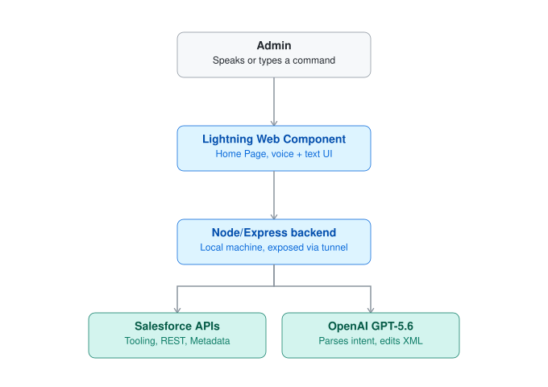
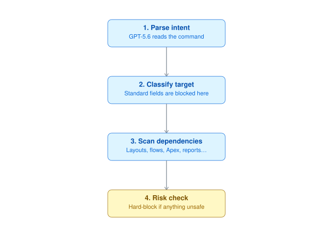
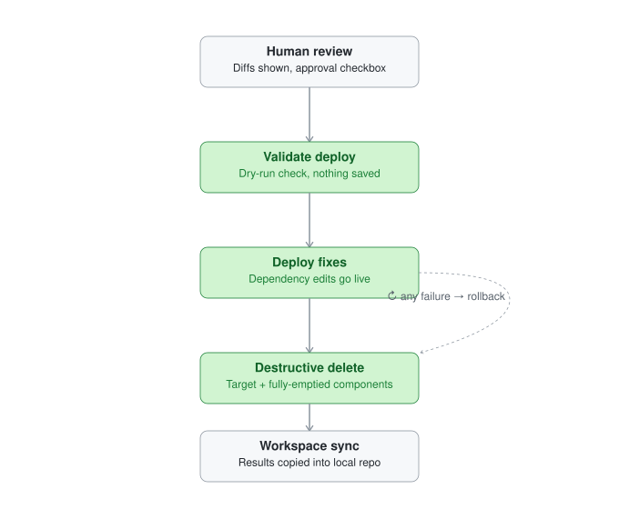

# Safe Metadata Delete

A review-first Salesforce admin tool for deleting custom fields and objects from a Lightning Home or App Page. Commands can be typed or dictated with browser-native Speech Recognition. The LWC calls a Node/Express service that reuses the existing `sf` CLI session for `hackathon-org`.

Planning is non-destructive: describe targets, block standard metadata, count object records, scan Tooling API dependencies, retrieve backups, and prepare AI-generated dependency-removal diffs. A one-time token and explicit approval click are required before deployment.

## Architecture

- **LWC** (`safeMetadataDelete`) — Home Page component. Voice via browser `SpeechRecognition`, or text.
- **Backend** (`server/`) — Node/Express, local machine, exposed via a Cloudflare tunnel. Reuses the existing `sf` CLI session, no OAuth/Connected App.
- **Salesforce** — Tooling API, REST API, Metadata API (retrieve/deploy/destructive delete).
- **OpenAI GPT-5.6** — parses the command into structured intent, edits XML/report JSON for auto-fixable dependencies.



Flow: parse intent → classify (block standard) → scan dependencies → hard-block on manual-review or incoming relationships → generate diffs → human approval → validate deploy → deploy fixes → destructive delete (target + any fully-emptied dependents) → sync to local project. Rollback available on any post-approval failure.




## Setup

Prerequisites: Node.js 18+, [Salesforce CLI](https://developer.salesforce.com/tools/salesforcecli), an OpenAI API key, [cloudflared](https://developers.cloudflare.com/cloudflare-one/networks/connectors/cloudflare-tunnel/downloads/).

**macOS** (tested end-to-end): `brew install node cloudflared`, install Salesforce CLI from the link above or `npm install -g @salesforce/cli`. Run everything from Terminal.

**Windows** (install steps only, not end-to-end tested): install Node and Salesforce CLI from their installers above (or `winget install Salesforce.sf`), and `cloudflared` from its [Windows installer](https://developers.cloudflare.com/cloudflare-one/networks/connectors/cloudflare-tunnel/downloads/). `fix-tunnel.sh` is a bash script — run it from **Git Bash** (bundled with [Git for Windows](https://gitforwindows.org/)) or **WSL2**, not PowerShell/CMD directly. One line needs a tweak first: in `fix-tunnel.sh`, change `sed -i ''` to `sed -i` (that empty-quote argument is macOS/BSD `sed` syntax; Git Bash and WSL both use GNU `sed`, which errors on it).

Steps below are identical on both platforms once prerequisites are installed:

1. `sf org login web --alias hackathon-org --set-default` (use a different alias if you want, then set `SF_ORG_ALIAS` in `.env` to match).
2. `npm install`
3. Copy `.env.example` to `.env`, set `OPENAI_API_KEY`. `BACKEND_API_TOKEN` already matches the value baked into the checked-in Home Page — leave it as-is, or change both if you want your own. Set `CORS_ORIGINS` to your org's exact Lightning/My Domain origin(s).
4. `sf project deploy start --source-dir force-app --target-org hackathon-org`
5. `npm run backend`, then `./fix-tunnel.sh` — starts a Cloudflare tunnel and points the org's CSP Trusted Site and Home Page at it automatically.
6. Setup → Lightning App Builder → open **Field and Object Deletion** (deployed in step 4) → Activation → assign as your Home Page (org default, or to a specific app/profile) → Save.

If the tunnel dies later (`Failed to Fetch` in the app — free tunnels have no uptime guarantee), rerun `./fix-tunnel.sh`.

No Salesforce OAuth flow or Named Credential is used — the server invokes `sf` CLI commands against whatever org `SF_ORG_ALIAS` points at (default `hackathon-org`), reusing the session from step 1.

## Testing without setup

Login credentials will be provided in private to test in live instance.

## Safety pipeline

`POST /api/plan` uses `gpt-5.6` structured output, validates API names, describes objects/fields, blocks standard or missing targets, scans `MetadataComponentDependency`, checks incoming relationship dependencies, retrieves backups, and generates complete-file XML edits plus unified diffs.

Apex, Flow, and unknown dependencies stop that target. Layout, ListView, Report, ValidationRule, and FlexiPage dependencies are eligible for proposed edits. Incoming lookup/master-detail fields stop object deletion. Mixed requests continue only for eligible custom targets.

`POST /api/runs/:id/approve` requires the random token and `confirmed: true`. It dry-run deploys dependency fixes, deploys them, then performs a separate post-destructive deployment. On a post-backup failure, `POST /api/runs/:id/rollback` redeploys the backup.

Run artifacts are under gitignored `safe-delete-runs/`. Restarting the backend intentionally invalidates pending approvals.

## Verification

```sh
npm run test:backend
npm run lint
npm run prettier:verify
```

Org deployment and destructive-path testing are intentionally not automated.
